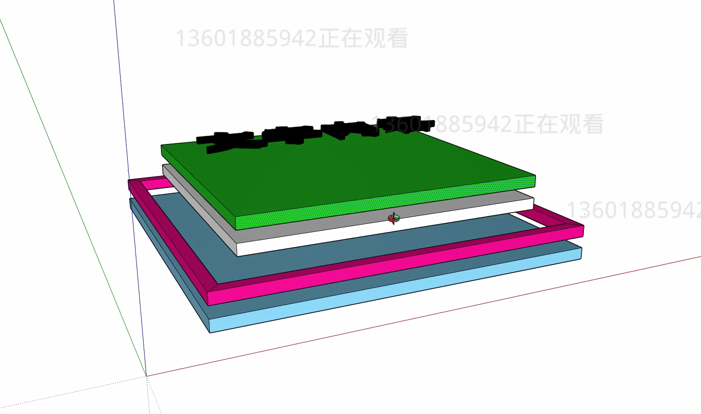
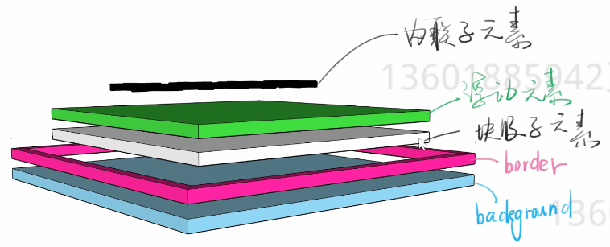
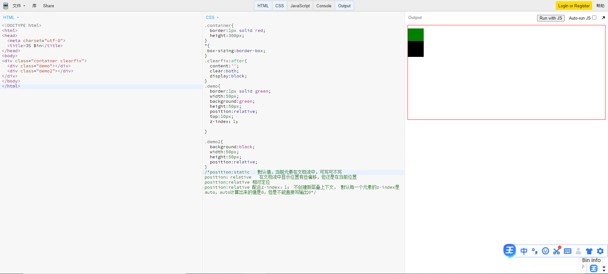
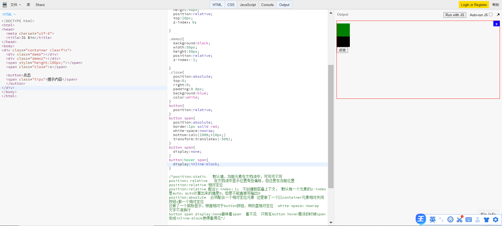
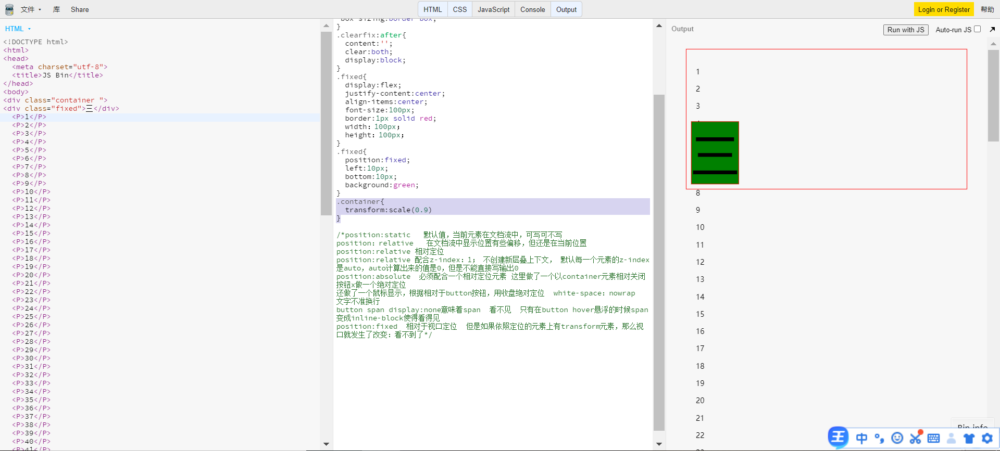
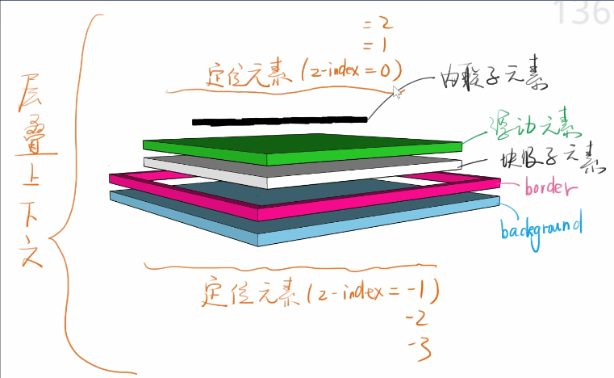
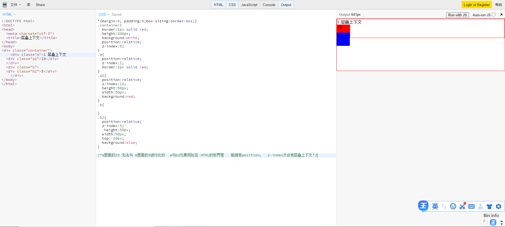

### CSS 定位

布局盒定位有什么区别：
布局是屏幕平面上的，定位是垂直于屏幕的，依然要先讨论下文档流盒盒模型
盒模型：margin，border，padding，内容

border 的范围从哪到哪？ 是 border 内边沿围成的区域还是 border 外边沿围成的区域？让 border 半透明试试
class 等于号后面加不加双引号 可加可不加，但是如果有空格是一定要加的
 浮动元素比正常的 div 要高一些。跳出了之前元素的文档流

新属性-position
·static 默认值，待在文档流里
·relative 相对定位，但不脱离文档流
·absolute 绝对定位，定位基准是祖先里的非 static
·fixed 固定定位，定位基准是 viewport
·sticky 粘滞定位

经验：如果写了 absolute，一般都得补一个 relative
·如果写了 absolute 不哦这 fixed，一定要补 top 和 left
·sticky 兼容性很差，主要用于面试的

position：relative
·使用场景：用于做位移（很少用）
·用于给 absolute 元素做爸爸
配合 z-index
·z-index：auto 默认值，不会创建新层叠上下文
·z-index：0/1/2
·z-index：-1/-2
经验：写 z-index：9999 的都是垃圾
学会管理 z-index

position：absolute
使用场景：脱离原来的位置另起一层，比如对话框的关闭按钮
鼠标提示
·配合 z-index
·经验：很多 BB 都认为 absolute 是相对于 relative 定位的
·某些浏览器上如果不谢 top、left 会位置错乱 一定要写！！！
·善用 left：100%
·善用：left：50%；加负 margin

absolute 相对于祖先元素中最近的一个定位元素进行的定位的
如何查看悬浮隐藏的按钮宽度 检查点一一次 上面 hover 勾选一次：如何展示 hover 内容

position：fixed
使用场景：烦人的广告
·回到顶部按钮
·配合 z-index
·经验：手机上尽量不要用这个属性，坑很多
·可以试着搜一下{移动端 fixed}

层叠上下文：

层叠上下文也叫堆叠上下文
https://developer.mozilla.org/zh-CN/docs/Web/Guide/CSS/Understanding_z_index/The_stacking_context

每个层叠上下文就是一个新的小世界（作用域）
这个小世界里面的 z-index 跟外界无关
处在同一个小世界的 z-index 才能比较

那些不正交的属性可以创建它
·MDN 文档有写 ·需要有 z-index 为 0/flex/opacity 不为 1/transform ·知道了这写知识即可 opacity 与 background 的区别：opacity 影响整个元素 background 只影响背景色
·忘了就搜层叠上下文 MDN
